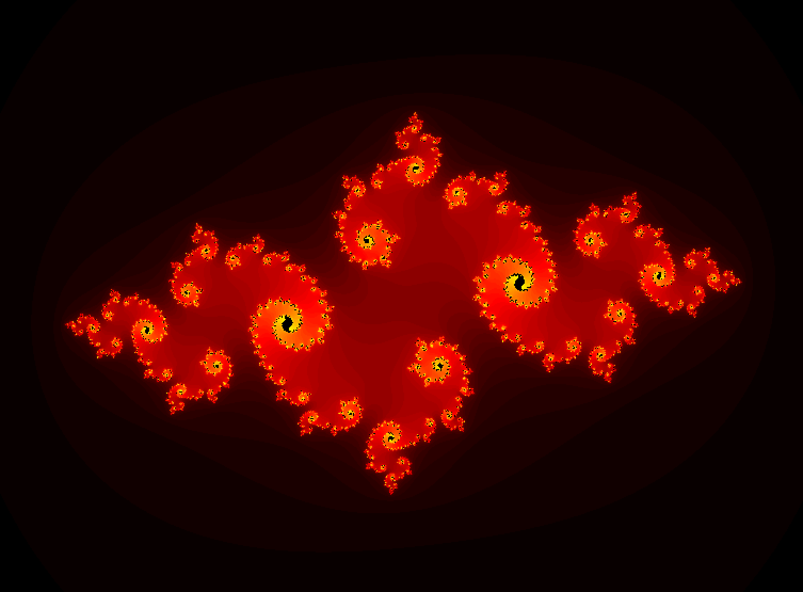
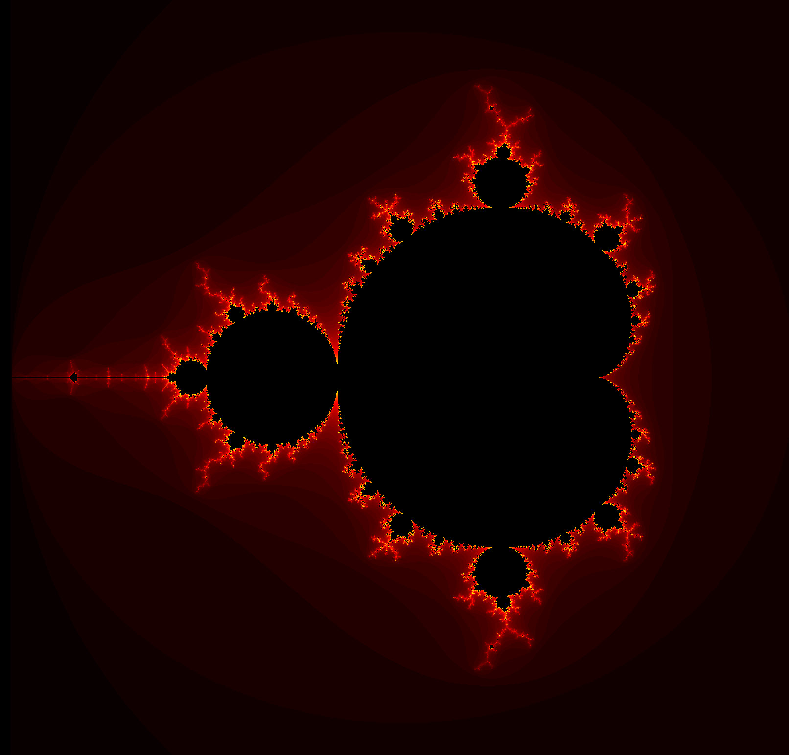
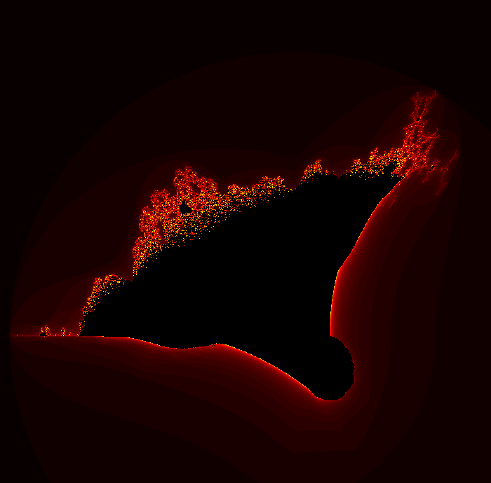
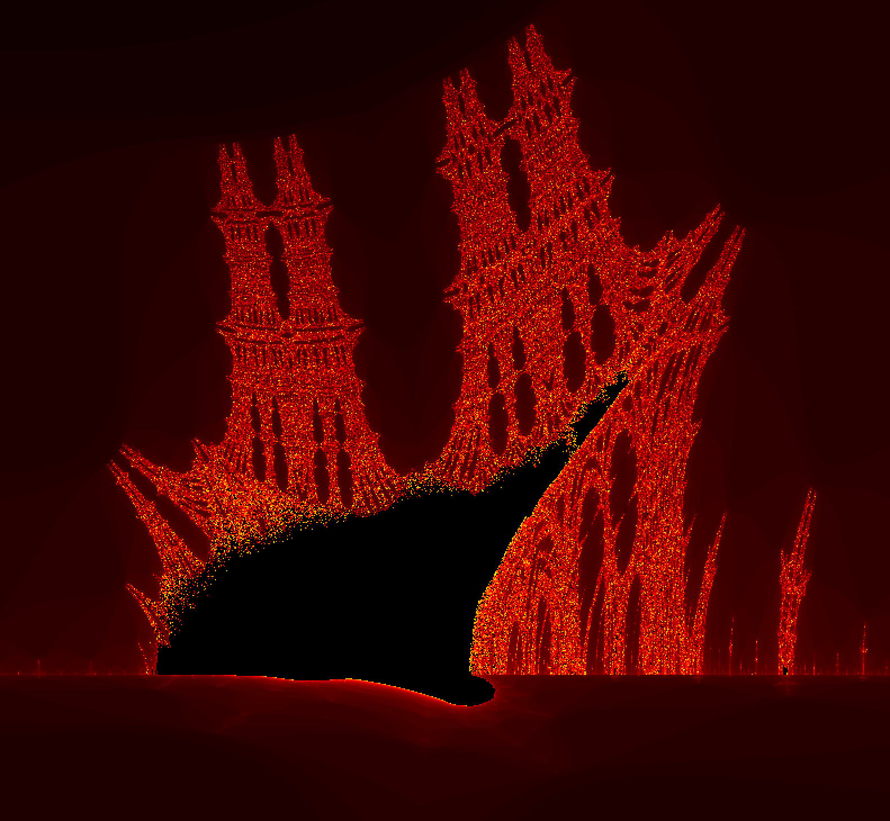

# Fractol
Second project on Computer Graphics branch. A small fractal exploration program.

## About
This program generates eight different fractals, specifically: 
- Julia
- Mandelbrot
- Mandelbrot (4th degree)
- Burning Ship
- Celtic Mandelbrot
- Tricorn
- Heart Mandelbrot
- Buffalo

A parameter passed on the command line defines what type of fractal will be viewed. It is possible to open all fractals at a time by passing few parameters.

## How to run
After downloading, open a folder in terminal and run `make`. This will create an executable with object files. Then execute a program:
```
./fractol julia
```


### Mandelbrot:



### Burning Ship:



It's also possible to zoom in:




### Controls
```
arrows            | to move left and right, up and down

+ / -             | to change number of iterations

mouse wheel       | to zoom in/out

mouse pointer     | to change Julia's parameter (without clicking)

space button      | to freeze/unfreeze Julia 

ESC               | to exit
```
